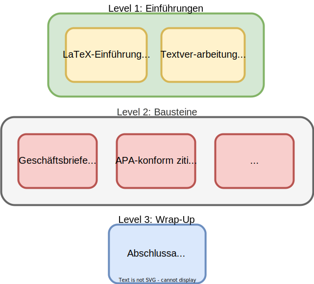

layout: true
  

  <table>
    <tr>
      <td style="text-align:right">Sächsische Landesbibliothek – Staats- und Universitätsbibliothek</td>
      <td>02.02.2023</td>
      <td style="text-align:right"><a href="https://www.slub-dresden.de/">www.slub-dresden.de</a></td>
    </tr>
    <tr>
      <td style="text-align:right">Referat 4.3</td>
      <td />
    </tr>
  </table>

  <table>
    <tr>
      <td style="text-align:left"><b>Kay-Michael Würzner</b></td>
    </tr>
    <tr>
      <td style="text-align:left">Referat 4.3</td>
    </tr>
    <tr>
      <td style="font-size:8pt"><b>04.12.2023</b></td>
    </tr>
    <tr>
      <td style="font-size:8pt">LaTeX@SLUB</td>
    </tr>
  </table>

---

class: title-slide
count: false

# LaTeX-Bausteine
## Quellcodelistings

---

# Überblick

- LaTeX@SLUB
- LaTeX-Paket [`listings`](https://ctan.org/pkg/listings)
- Hands-on in [`ShareLatex`](https://tex.zih.tu-dresden.de/)

---

class: part-slide
count: false

# LaTeX@SLUB

---

# LaTeX@SLUB

.cols[
.fifty[
- LaTeX als Teil des bibliothekspädagogischen Angebots
- **Ziele:**
  + LaTeX als Textsatzprogramm etablieren
  + *Computer literacy* stärken
  + wissenschaftliche Professionalität stützen
]
.fifty[

]
]

---

class: part-slide
count: false

# LaTeX-Paket listings

---

# LaTeX-Paket listings

- alle Lebenslaufelemente als vordefinierte Makros, e.g.
  + Datum: `date`
  + Ort: `cvplace`
  + Abschnitte: `cvlist`
- Alternativen, e.g.
  + [vita](https://ctan.org/pkg/vita)
  + [cv](https://ctan.org/pkg/cv)
  + [ecv](https://ctan.org/pkg/ecv)
- ähnliche Konzepte, unterschiedliche Makrobenamung, e.g.
  + `cvlist` → `ecvSec`

---

class: part-slide
count: false

# Demo

---

class: part-slide

# Vielen Dank für Ihre Aufmerksamkeit!

<a href="https://wrznr.github.io/latex-modules-listings/#1">wrznr.github.io/latex-modules-listings</a>

